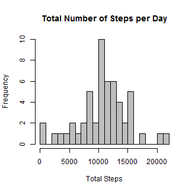
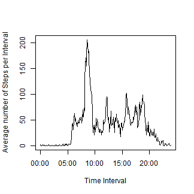
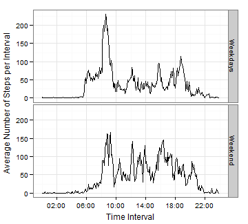

This document generates the analysis of personal activity monitoring device data and addresses questions of assignment 1. 

Setting global options for .Rmd file:


```r
library(knitr)
opts_chunk$set(echo=TRUE, warning=FALSE, fig.path="figures/", options(scipen=10))
```

## Data
The variables included in this dataset are:

- steps: Number of steps taking in a 5-minute interval (missing values are coded as NA)

- date: The date on which the measurement was taken in YYYY-MM-DD format

- interval: Identifier for the 5-minute interval in which measurement was taken

The dataset is stored in a comma-separated-value (CSV) file and there are a total of 17,568 observations in this dataset.

## Loading Data
The zip archive containing the data is downloaded into the current working directory using the following code which creates the variable `url` storing the link of the .zip archive.


```r
 url <- "https://d396qusza40orc.cloudfront.net/repdata%2Fdata%2Factivity.zip"
 download.file(url, "ActivityMonitoringData")
```

Unzipping the data into a folder `data_files` is done using the following code:

```r
 unzip("ActivityMonitoringData", exdir="data_files")
```

The path to the .csv file in the folder `data_files` is stored in `data_dir` and data is read in and stored in the object `data`  with the following code:


```r
data_dir    <- dir("data_files", full.names=TRUE)
data        <- read.table(data_dir[1], stringsAsFactors=FALSE, na.strings="NA",sep=",", header=TRUE)
```


## What is mean total number of steps taken per day?
For this part of the assignment, you can ignore the missing values in the dataset.

1. Make a histogram of the total number of steps taken each day


The `plyr` package was used to generate the total number of steps taken each day stored under the variable `total_steps
`:

```r
library(plyr)
steps_total <- ddply(data, .(date), summarize, total_steps = sum(steps, na.rm=TRUE))
```

The base plotting system was used to present the distribution of total steps per day. Because the same data represenation will be used later on, a function called `histogram` was written and called for the variable `total$steps`, once for the .png file and once for embedding in the html document:


```r
histogram <- function(x){
    par(bg="white")
    hist(x, 
         col="grey",
         xlab="Total Steps",
         main="Total Number of Steps per Day",
         breaks=20)
}
    
png("steps_total.png")
histogram(x=steps_total$total_steps)
dev.off()
histogram(x=steps_total$total_steps)
```

 

2. Calculate and report the mean and median total number of steps taken per day

```r
mean_steps_total    <- round(mean(steps_total$total_steps, na.rm=TRUE),2)
median_steps_total  <- median(steps_total$total_steps, na.rm=TRUE)
```
The mean and median values of `total_steps` per day are 9354.23 and 10395, respectively.

## What is the average daily activity pattern?

1. Make a time series plot (i.e. type = "l") of the 5-minute interval (x-axis) and the average number of steps taken, averaged across all days (y-axis).

Average steps per interval across all days is generated with the following equation and stored in the dataframe `avg_steps` under the variable `average_steps`:


```r
avg_steps <- ddply(data, .(interval), summarize, average_steps=round(mean(steps, na.rm=TRUE)),2)
```

The time series plot is saved as a .png file and embedded in the html document.

```r
png("avg_steps.png")
par(bg="white")
plot(avg_steps$interval, avg_steps$average_steps, 
     type="l",
     xlab="Interval",
     ylab="Average number of Steps per Interval ")
dev.off()

par(bg="white")
plot(avg_steps$interval, avg_steps$average_steps, 
     type="l",
     xlab="Interval",
     ylab="Average number of Steps per Interval")
```

 

2. Which 5-minute interval, on average across all the days in the dataset, contains the maximum number of steps?

```r
max_avg_steps <- avg_steps[which(avg_steps$average_steps==max(avg_steps$average_steps)),1]
max_avg_steps
```

```
## [1] 835
```

Interval 835 is the interval with the maximum average number of steps.

## Imputing missing values

1. Calculate and report the total number of missing values in the dataset (i.e. the total number of rows with NAs).

```r
na_total <- sum(is.na(data$steps))
na_total
```

```
## [1] 2304
```

The total number of missing values (i.e. `NA`) is 2304.

2. Devise a strategy for filling in all of the missing values in the dataset. The strategy does not need to be sophisticated. For example, you could use the mean/median for that day, or the mean for that 5-minute interval, etc.

The mean of the corresponding interval was used to fill in for `NA` values. To do this, the original data frame stored in `data` is merged with the summarized data `avg_steps` by the variable `interval`. Through indexing, the variable `steps` where `is.na` is `TRUE` is replaced by the variable `avg_steps` corresponding to the respective `interval`.


```r
merge_data                                      <- merge(data, avg_steps)
merge_data[which(is.na(merge_data$steps)),2]    <- merge_data$average_step[which(is.na(merge_data$steps))]
```

3. Create a new dataset that is equal to the original dataset but with the missing data filled in.
The additional column `avg_steps` is then removed from the dataframe.

```r
merge_data$average_steps <-NULL
```

4. Make a histogram of the total number of steps taken each day and Calculate and report the mean and median total number of steps taken per day. Do these values differ from the estimates from the first part of the assignment? What is the impact of imputing missing data on the estimates of the total daily number of steps?

Total steps per day using imputed values were calculated as follows and presented in a histogram using the histogram function `histogram` from before.


```r
steps_total_new <- ddply(merge_data, .(date) , summarize, total_steps_new=sum(steps))

png("steps_total_new.png")
histogram(steps_total_new$total_steps_new)
dev.off()
histogram(steps_total_new$total_steps_new)
```

 

Mean and median of dataframe with imputed values were re-generated.

```r
mean_steps_total_new    <- round(mean(steps_total_new$total_steps_new, na.rm=TRUE),2)
median_steps_total_new  <- median(steps_total_new$total_steps_new, na.rm=TRUE)
```

Imputing values leads to an increase in the mean total steps from 9354.23 to 10765.64 and to an increase in the median from 10395 to 10762.

## Are there differences in activity patterns between weekdays and weekends?
1. Create a new factor variable in the dataset with two levels - "weekday" and "weekend" indicating whether a given date is a weekday or weekend day.

The `date` variable was formatted in the POSIXlt format and appended as a new column `Weekday`, only displaying the corresponding weekday represented by `wday` (0-6). Numbers corresponding to days of the week were replaced by `weekdays` or `weekend` and formatted as  factors. 


```r
merge_data$Weekday <- ifelse(as.POSIXlt(merge_data$date)$wday >=1 & as.POSIXlt(merge_data$date)$wday<=5, 
                             "Weekdays", "Weekend")
merge_data$Weekday <- as.factor(merge_data$Weekday)
```


2. Make a panel plot containing a time series plot (i.e. type = "l") of the 5-minute interval (x-axis) and the average number of steps taken, averaged across all weekday days or weekend days (y-axis).

Average number of steps   per interval and Weekday were calculated and plotted vs the intervals. 

```r
avg_steps_new <- ddply(merge_data, .(interval, Weekday), summarize, average_steps_new=round(mean(steps),2))

png("avg_steps_weekday.png")
library(ggplot2)
ggplot(avg_steps_new, aes(interval, average_steps_new))+
    geom_line()+
    facet_grid(Weekday~.)+
    xlab("Interval")+
    ylab("Average Number of Steps per Interval") +
    theme_bw()+
    theme(
        axis.title.x=element_text(vjust=-0.1),
        axis.title.y=element_text(vjust=1.5))

dev.off()
ggplot(avg_steps_new, aes(interval, average_steps_new))+
    geom_line()+
    facet_grid(Weekday~.)+
    xlab("Interval")+
    ylab("Average Number of Steps per Interval") +
    theme_bw()+
    theme(
        axis.title.x=element_text(vjust=-0.1),
        axis.title.y=element_text(vjust=1.5))
```

 

